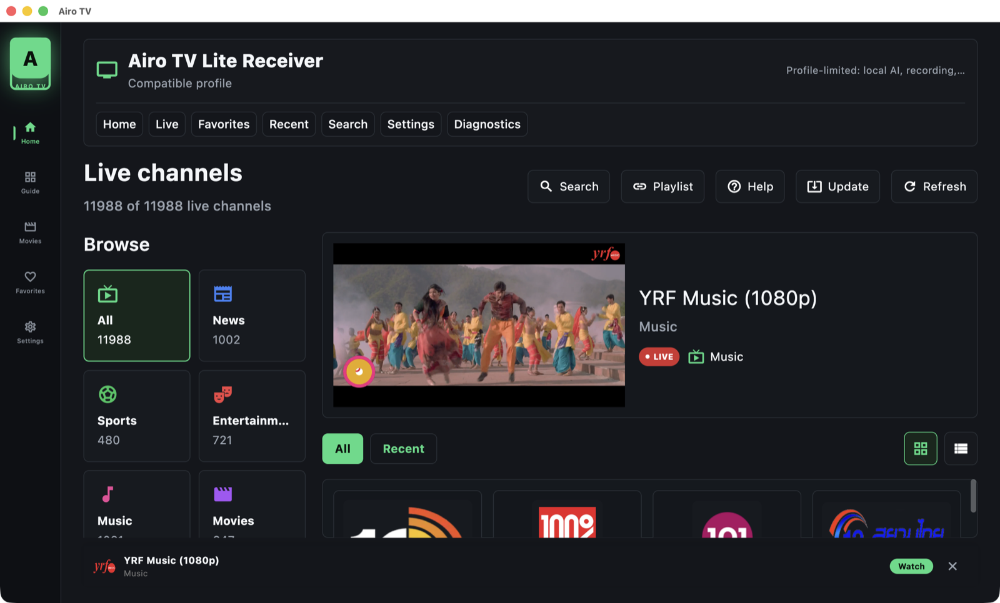
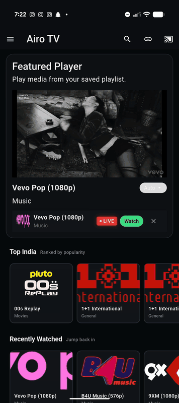

<div align="center">

# Airo

**The open-source super app — AI chat, personal finance, TV & music, games, and reading in one local-first Flutter codebase.**

🌐 **[developerscoffee.github.io/airo](https://developerscoffee.github.io/airo/)** — live showcase, guides, and roadmap

[](https://github.com/DevelopersCoffee/airo/releases)
[](https://github.com/DevelopersCoffee/airo/releases)
[](https://github.com/DevelopersCoffee/airo/actions/workflows/ci.yml)
[](https://sonarcloud.io/summary/new_code?id=DevelopersCoffee_airo)
[](LICENSE)
[](https://github.com/DevelopersCoffee/airo/commits/main)
[](https://github.com/DevelopersCoffee/airo/stargazers)



[Download](#download) · [Modules](#modules) · [Quick Start](#quick-start) · [Contributing](#contributing) · [Docs](#documentation)

</div>

---

**Airo is the home.** A modular super app built with Flutter — Airo TV is its
first focused product, available now. Every module is local-first: your data,
playlists, and conversations stay on your device by default. On-device AI
drives the experience — model routing, offline fallback, and privacy-forward
interactions in a real shipping app, not a demo.

## Modules

| Module | What it does | Status |
|---|---|---|
| 📺 **Airo TV** | Bring-your-own-playlist IPTV player for Android TV | **Available — [v0.0.4](https://github.com/DevelopersCoffee/airo/releases/tag/airo-tv-v0.0.4)** |
| ⭐ **Airo TV Pro** | Import intelligence, resilient playback, guide intelligence | In testing |
| 🤖 **Airo AI** | On-device AI chat (Gemini Nano), model management, agent skills | In development |
| 💰 **AiroMoney** | Personal finance tracking and money workflows | In development |
| 🎵 **Airo Music** | Music playback surfaces | In development |
| ♟️ **Airo Games** | Chess and casual games (Stockfish engine) | In development |
| 📖 **Airo Reader** | Reading surfaces with OCR | In development |

All modules live in one monorepo with strict package boundaries — see the
[Repository Map](#repository-map).

## 📺 Airo TV — Available Now

[](https://github.com/DevelopersCoffee/airo/releases/download/airo-tv-v0.0.4/Airo-TV-0.0.4.apk)
[](https://developerscoffee.github.io/airo/)

### See it in action

| macOS (desktop) | Pixel 9 (mobile) |
|---|---|
|  |  |

Airo TV is the focused Android TV build of Airo's media module
(`io.airo.app.tv`). TV-first channel grid, search, and playback for your own
M3U/M3U8 playlists.

- **Bring your own playlist** — Airo TV ships no IPTV content and no bundled channels.
- **Google Cast support** — requires `_googlecast._tcp` discovery and port `8009` on the local network.
- **Verifiable releases** — APK, Play Store AAB, macOS preview, and SHA256 checksums on every release.
- **Honest device support** — Android TV available, Fire TV experimental, mobile partial, macOS preview, iPad verified; see [device paths](https://developerscoffee.github.io/airo/).
- **Documented** — [architecture](docs/architecture/AIRO_TV_ARCHITECTURE.md), [threat model](docs/security/AIRO_TV_THREAT_MODEL.md), [release docs](docs/release/README.md).

## Download

| Platform | Link |
|---|---|
| 📺 Android TV | [Airo TV v0.0.4 APK](https://github.com/DevelopersCoffee/airo/releases/download/airo-tv-v0.0.4/Airo-TV-0.0.4.apk) |
| 🖥️ macOS (preview) | [Airo TV DMG](https://github.com/DevelopersCoffee/airo/releases/download/airo-tv-v0.0.4/Airo-TV-0.0.4-macOS.dmg) |
| 🤖 Android | [Android releases](https://github.com/DevelopersCoffee/airo/releases) |
| 🍎 iOS | [Latest IPA](https://github.com/DevelopersCoffee/airo/releases/latest/download/app-release.ipa) |
| 🌐 Web | [Web build](https://github.com/DevelopersCoffee/airo/releases/latest/download/airo-web-release.zip) |
| 📦 All | [All releases](https://github.com/DevelopersCoffee/airo/releases) |

Before installing a direct-download APK, verify it against
[`SHA256SUMS`](VERIFY_DOWNLOAD.md).

## Why Trust Airo?

- Open-source codebase with public issue tracking and a transparent [roadmap](ROADMAP.md).
- Local-first: playlists and data stay on the device unless you load a remote URL directly.
- No bundled IPTV channels or copyrighted content.
- SHA256 checksums published for every release APK and AAB.
- Public [security policy](SECURITY.md), [privacy policy](PRIVACY.md), [threat model](docs/security/AIRO_TV_THREAT_MODEL.md), and [trust report](TRUST.md).
- No hidden subscriptions and no mandatory accounts for the Airo TV player flow.

## Quick Start

```bash
git clone git@github.com:DevelopersCoffee/airo.git
cd airo
make setup        # or: make setup-android / setup-ios / setup-web
```

Run the app:

```bash
make run-android  # or: run-ios / run-web / run-chrome
```

Verify changes:

```bash
make format && make analyze && make test
```

Run `make help` for the full command list, including device-targeted helpers
(`run-pixel9`, `run-iphone13`). For the Airo TV Edge Intelligence runtime
(Rust FFI, media packs), see
[docs/features](docs/features/README.md).

### Platform Support

- **Android**: API 24+ · **iOS**: 12.0+ · **Web**: modern browsers (Chrome preferred for development).

Android release builds require private signing material. Never commit
`app/android/key.properties`, keystores, tokens, API keys, or local credentials.

## Repository Map

```text
.
├── app/                  # Flutter host application
├── packages/
│   ├── airo/             # AI-oriented package surface
│   ├── airomoney/        # Personal finance package surface
│   ├── core_ai/          # AI contracts, registries, skills, model metadata
│   ├── core_auth/        # Authentication package
│   ├── core_data/        # Data and networking utilities
│   ├── core_domain/      # Domain primitives
│   └── core_ui/          # Shared UI package
├── docs/                 # Architecture, agent policy, wiki source, runbooks
├── e2e/                  # End-to-end assets and checks
├── scripts/              # Local automation
└── .github/              # CI, issue templates, PR template
```

## Contributing

Airo is an open-source playground for developers who care about on-device AI,
agent-driven engineering, and cross-platform Flutter architecture. Star the
repo to follow the work; fork it to experiment or send a PR.

Good entry points:

- Docs fixes, onboarding polish, and troubleshooting guides.
- Host-only tests, bug reproduction, and accessibility improvements.
- [`good first issue`](https://github.com/DevelopersCoffee/airo/issues?q=is%3Aissue+is%3Aopen+label%3A%22good+first+issue%22) · [`help wanted`](https://github.com/DevelopersCoffee/airo/issues?q=is%3Aissue+is%3Aopen+label%3A%22help+wanted%22)

Workflow:

1. Read [`CONTRIBUTING.md`](CONTRIBUTING.md).
2. Pick or create a GitHub issue.
3. Follow the agent gate and Feature Packet flow in [`docs/agents/AGENT_POLICY.md`](docs/agents/AGENT_POLICY.md).
4. Branch from `origin/main`, keep the PR scoped, run the relevant checks.

## Documentation

- [Architecture](docs/architecture/README.md) · [Features](docs/features/README.md) · [Security](docs/security/README.md) · [Release](docs/release/README.md) · [Troubleshooting](docs/troubleshooting/README.md) · [Wiki source](docs/wiki/README.md)
- Release engineering: [V2 orchestrator](docs/release/V2_RELEASE_ORCHESTRATOR.md) · [release workflow](.github/workflows/release-orchestrator.yml) · [publishing human setup](docs/release/V2_PUBLISHING_HUMAN_SETUP.md) · [release checklist](docs/release/RELEASE_CHECKLIST.md) · [repository health](docs/release/REPOSITORY_HEALTH_STATUS.md)

## Community Standards

[Contributing](CONTRIBUTING.md) · [Code of Conduct](CODE_OF_CONDUCT.md) · [Security Policy](SECURITY.md) · [Trust](TRUST.md) · [Privacy](PRIVACY.md) · [Roadmap](ROADMAP.md) · [Changelog](CHANGELOG.md) · [Download Verification](VERIFY_DOWNLOAD.md)

## License

Airo is licensed under the [MIT License](LICENSE).

Release profiles include third-party dependencies with their own licenses. See
[Third-Party Notices](docs/release/V2_THIRD_PARTY_NOTICES.md) and the
[License Review](docs/release/V2_LICENSE_REVIEW.md) before public
redistribution.
