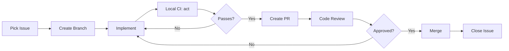

# 📋 Airo SDLC Process

> Software Development Life Cycle for Agent-Based Development

## 🔄 Development Workflow

### 1. Issue Assignment
```
Issue Created → Backlog → Ready (when dependencies met) → Assigned
```

### 2. Development Flow


### 3. Branch Naming
```
agent/<agent-name>/<issue-number>-<short-description>

Examples:
- agent/core-architecture/5-normalize-packages
- agent/finance/8-save-expense-flow
- agent/ai-llm/7-gemini-nano-adapter
```

### 4. Commit Messages
```
<type>(<agent>): <description>

Types: feat, fix, refactor, test, docs, chore, ci, security

Examples:
- feat(finance): add save expense to transaction flow
- fix(ai): handle Gemini Nano initialization timeout
- test(qa): add OCR price parsing regression tests
- docs(docs): create ADR-001 package structure
```

### 5. PR Requirements
- [ ] Branch is up-to-date with main
- [ ] `act` local CI passes
- [ ] `flutter analyze` clean
- [ ] `flutter test` passes
- [ ] Issue linked in PR description
- [ ] Acceptance criteria met
- [ ] No merge conflicts

---

## 📊 GitHub Project Board Columns

| Column | Description | Entry Criteria |
|--------|-------------|----------------|
| **Backlog** | All unstarted issues | Issue created |
| **Ready** | Dependencies met, can start | Blocking issues closed |
| **In Progress** | Actively being worked on | Branch created |
| **Blocked** | Waiting on external | Document blocker in comment |
| **Review** | PR open, awaiting review | PR created |
| **QA** | Testing in progress | PR approved |
| **Done** | Complete | PR merged |

---

## 🏷️ Label Usage

### Required Labels (Every Issue)
- `agent/<name>` - Which agent owns this
- `priority/P0|P1|P2` - Priority level
- `type/task|bug|feature` - Type of work

### Optional Labels
- `blocked` - Waiting on something
- `needs-design` - Requires design decision
- `needs-qa` - Extra testing needed
- `breaking` - Breaking change

---

## 📝 Issue Updates

### When to Comment
- Starting work: "Starting work on this"
- Progress update: "Completed X, working on Y"
- Blocked: "Blocked by #N because..."
- Completed subtask: Check off in issue body
- Lessons learned: Document what you discovered

### Comment Format
```markdown
## Status Update - YYYY-MM-DD

**Progress:**
- [x] Completed task 1
- [ ] Working on task 2

**Blockers:** None / Blocked by #N

**Next Steps:**
- Task 3
- Task 4

**Lessons Learned:**
- Discovery or pattern to remember
```

---

## 🔐 Security Rules

1. **No secrets in code** - Use `.vscode/secrets/` (gitignored)
2. **No secrets in issues** - Reference by name only
3. **Scan before commit** - `git secrets --scan`
4. **Report vulnerabilities** - Create security issue privately

---

## 🚀 Release Process

1. All P0-P2 issues for milestone closed
2. QA Agent completes smoke tests
3. Release Agent creates release PR
4. Changelog auto-generated
5. Tag created: `v1.x.x`
6. CI builds and uploads artifacts
7. Store submission (if applicable)

---

## 📈 Metrics We Track

| Metric | Target | Measured By |
|--------|--------|-------------|
| Cycle Time | <3 days | Issue open → closed |
| PR Review Time | <24h | PR open → approved |
| CI Pass Rate | >95% | GitHub Actions |
| Test Coverage | Core ≥80%, Features ≥60% | Coverage report |
| Bug Escape Rate | <5% | Bugs found post-release |

---

## 🔄 Continuous Improvement

### Weekly Review
1. What issues were completed?
2. What blocked us?
3. What can we automate?
4. What rules need updating?

### Rule Change Process
1. Identify improvement
2. Propose in Issue comment or Discussion
3. Create PR to update RULES.md or SDLC.md
4. Get approval
5. Merge and announce

