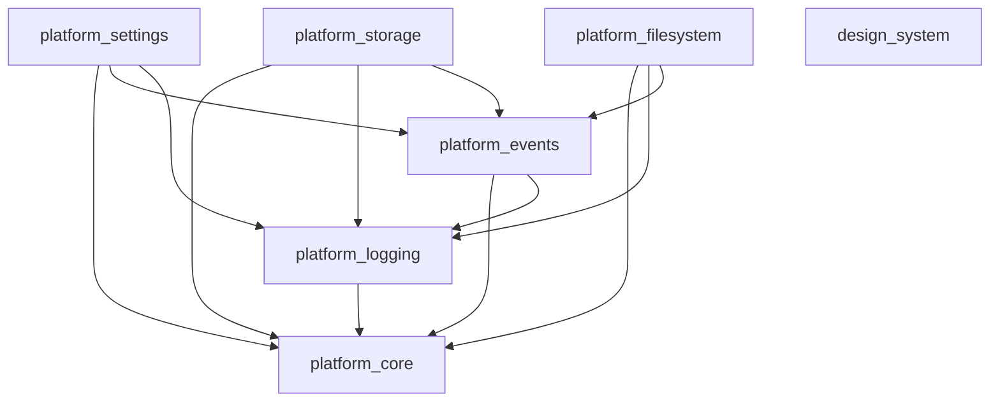

# Dependency Graph (Program 0 Baseline)

This graph maps the physical dependencies of the Program 0 architecture as enforced by `pubspec.yaml` files.

## Constraints
* The graph is strictly acyclic.
* `platform_core` is the root node. It depends on nothing.
* All other packages depend on `platform_core`.
* Storage and Filesystem do not depend on each other.
* Settings depends on Events to broadcast changes, but Events does not depend on Settings.
