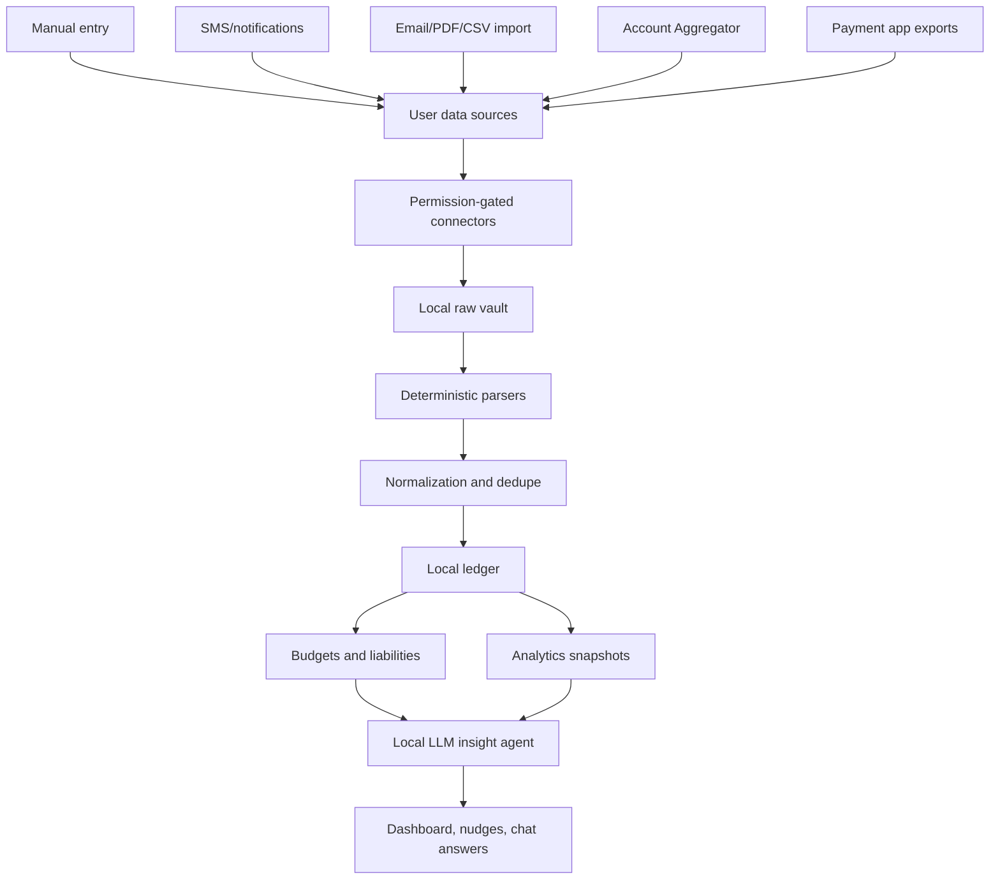

# Coins Personal Money Management Framework

Last researched: 2026-06-20

## Objective

Build Coins into a local-first personal money manager for Indian users. The first outcome is simple: make the user aware of how much they spent today, this week, this month, and what liabilities are coming due. The product should work even when the user is not comfortable sending raw bank, card, SMS, or statement data to a server.

This framework extends the current Coins/Money base of local transactions, budgets, budget deduction, and insights.

## Market Pattern In India

| Product | Useful pattern to borrow | Notes for Airo |
| --- | --- | --- |
| Axio / Walnut | SMS-based expense tracking, daily/monthly expenses, credit card dues, bill reminders, notes, categories, tags, bill/receipt photos. | This validates SMS parsing as an Indian-market workflow, but it also shows the fragility: missed bank SMS formats and heavy permissions. Source: [Google Play - axio](https://play.google.com/store/apps/details?hl=en_US&id=com.daamitt.walnut.app). |
| ET Money | Reads transaction alert SMS and extracts amount, merchant, date, etc. | Good reference for limited extraction language: parse only financial alerts, not personal SMS content. Source: [ET Money help](https://www.etmoney.com/help/others/expense-manager/how-does-etmoney-track-my-expenses). |
| CRED | Multi-card management, credit card bill payments, reminders, hidden charge detection, duplicate spend detection, smart statements, credit score. | Strong model for the liabilities dashboard: cards, due dates, minimum due, total due, duplicate/hidden fee alerts. Source: [Google Play - CRED](https://play.google.com/store/apps/details?hl=en_US&id=com.dreamplug.androidapp). |
| INDmoney | Net worth view across bank accounts, credit cards, SIPs, bonds, NPS, FDs, stocks, mutual funds; credit card transaction tracking and analytical categories. | Strong model for the long-term destination: one view of assets, liabilities, investments, and family finances. Sources: [Google Play - INDmoney](https://play.google.com/store/apps/details?hl=en_US&id=in.indwealth), [INDmoney credit card tracker](https://www.indmoney.com/features/track-credit-card-bills). |
| PhonePe | UPI, linked bank accounts, instant balance checks, bill payments, automated reminders, credit card bill payment. | Treat as a payment/bill source first, not a budgeting source. For v1, ingest user-exported PhonePe statements/PDFs instead of trying to scrape. Source: [Google Play - PhonePe](https://play.google.com/store/apps/details?hl=en_CA&id=com.phonepe.app). |
| Jupiter | Automatic spend categorization, real-time spend breakdowns, multiple bank account linking, monthly net worth/spend/savings overview. | Good mental model for the user-facing dashboard: "where did money go?" and "what remains?" Source: [Jupiter expense tracker roundup](https://jupiter.money/blog/best-expense-tracker-app/). |

## Regulatory And Platform Reality

India has a real open-finance path through the Account Aggregator framework. The Department of Financial Services describes AA as an RBI-introduced financial data-sharing system where no financial information is retrieved, shared, or transferred without explicit customer consent. As of 2026-03-31, it listed 17 AA companies with certificates of registration, 179 live FIPs, 989 live FIUs, more than 2.88 billion enabled financial accounts, and 284.6 million linked accounts. Source: [Department of Financial Services - Account Aggregator Framework](https://financialservices.gov.in/account-aggregator-framework).

Sahamati lists active RBI-licensed Account Aggregators such as Setu AA, CAMSFinServ, Finvu, CRIF Connect, OneMoney, Protean SurakshAA, Perfios Anumati, and others. Source: [Sahamati - Account Aggregators in India](https://sahamati.org.in/account-aggregators-in-india/).

AA can cover more than simple bank transactions. Sahamati documents financial information types including deposits, recurring deposits, term deposits, SIPs, equity shares, and mutual fund units, with regulators across RBI, SEBI, IRDAI, PFRDA, and the Department of Revenue. Source: [Sahamati - FI types on AA](https://sahamati.org.in/data-fi-types-available-on-aa/).

Android SMS access is high-risk and controlled. Google Play restricts SMS and Call Log permissions, while listing SMS-based financial transactions such as UPI and financial verifications as an allowed category. Source: [Google Play SMS/Call Log policy](https://support.google.com/googleplay/android-developer/answer/10208820?hl=en).

## Product Direction

Do not start by promising "auto fetch every latest statement from every bank, card, and PhonePe." That is brittle and will quickly run into platform, bank, and compliance limits.

Start with a local-first financial inbox:

1. Manual quick-add for cash and missing transactions.
2. Local SMS/notification transaction parser on Android, permission gated.
3. Statement import from PDF, CSV, image, and email attachments.
4. Credit card statement parser for due date, total due, minimum due, fees, interest, transactions, reward reversals, and payment status.
5. PhonePe/GPay/Paytm statement import from user-exported PDFs or CSVs.
6. Account Aggregator integration as the regulated consent-based path for bank and investment data.
7. Optional cloud sync only after user opts in, with encrypted payloads and no raw statement upload by default.

## Architecture



### Layers

| Layer | Responsibility |
| --- | --- |
| Source adapters | SMS parser, notification listener, file picker import, email attachment import, CSV/PDF parsers, AA connector, future bank/card connectors. |
| Raw vault | Encrypted local storage for original source records. Keep source hashes so we can reparse after parser improvements without duplicating data. |
| Normalization | Convert all sources into a single ledger format: amount, direction, account, merchant, category, timestamp, counterparty, instrument, confidence. |
| Reconciliation | Merge SMS transaction, card statement line, UPI app export, and bank transaction into one canonical transaction when they represent the same spend. |
| Budget engine | Category budgets, weekly/monthly spend limits, rollover rules, alerts, "safe to spend" calculation. |
| Liability engine | Credit card total due, minimum due, due date, statement period, loan EMI, BNPL/pay-later due, recurring bills. |
| Local LLM agent | Explains trends, classifies unknown merchants, detects unusual spending, answers questions over summarized local data. It should not get direct OS permissions. |
| Consent ledger | Records each permission, imported file, external connector, AA consent, retention policy, and revoke/delete action. |

## Data Model Additions

Current Coins tables already cover transaction entries, budget entries, and account entries. Add these concepts before adding integrations:

| Entity | Purpose |
| --- | --- |
| `financial_sources` | SMS, notification, manual, PDF, CSV, email, AA, payment_app_export. |
| `raw_financial_records` | Encrypted original SMS text, normalized email metadata, imported file reference, AA payload reference, source hash. |
| `financial_instruments` | Bank account, credit card, wallet, cash, UPI handle, loan, FD, mutual fund, NPS, stock account. |
| `statement_cycles` | Card/account statement period, issue date, due date, total due, minimum due, previous balance, payments. |
| `liability_entries` | Credit card dues, EMI, BNPL/pay-later, loan repayment, utility bills. |
| `merchant_aliases` | Raw merchant names mapped to canonical merchants and categories. |
| `budget_rules` | Category limits, merchant limits, weekly caps, rollover/carry-forward behavior. |
| `dedupe_links` | Links multiple source records to one canonical ledger transaction. |
| `consent_records` | Permission, connector, purpose, data scope, granted_at, revoked_at, retention. |
| `insight_snapshots` | Precomputed daily/weekly/monthly aggregates for fast UI and local LLM context. |

## Credit Card Statement Flow

V1 should support three paths:

1. User imports a statement PDF from file picker or email attachment.
2. User grants local email access or forwards card statements to a generated inbox later.
3. User grants AA/card data access when a compliant provider path is available.

Parsing pipeline:

1. Detect issuer and statement format.
2. Unlock known password patterns only when the user configures them locally.
3. Extract summary: statement date, due date, total due, minimum due, credit limit, available limit.
4. Extract line items.
5. Normalize merchants and categories.
6. Reconcile statement line items with SMS/notification transactions.
7. Create liability entry for unpaid due.
8. Alert for fees, interest, duplicate spends, refunds not credited, and unusually high categories.

Avoid sending automated emails/SMS to banks as the main mechanism. It is unreliable across issuers and can look like automation against consumer banking workflows. Use imported statements and consented data access first.

## PhonePe And UPI Strategy

For PhonePe, GPay, Paytm, and similar apps:

1. V1: import exported statement PDFs/CSVs locally.
2. Android: parse bank/UPI SMS and payment notifications where permission is granted.
3. Later: pursue official PSP/TPAP/payment partnerships only if Airo is entering payments directly.

Do not scrape payment apps or automate consumer app UIs. It is brittle, high risk, and hard to justify for a privacy-first product.

## Local LLM Usage

Use deterministic code for accounting and liability math. Use the local LLM for interpretation and assistance:

| Task | Rules first | Local LLM role |
| --- | --- | --- |
| Amount/date extraction | Yes | Only fallback for messy OCR text. |
| Statement totals | Yes | Explain mismatch or missing lines. |
| Merchant categorization | Yes, aliases first | Suggest category with confidence and ask when unsure. |
| Spend insights | Aggregations first | Turn aggregates into clear explanations and action suggestions. |
| Budget advice | Budget engine first | Suggest a realistic adjustment, not financial advice. |
| Chat queries | SQL/aggregate tool first | Summarize answer in natural language. |

The LLM should receive minimized structured context, for example:

```json
{
  "period": "2026-06",
  "totalSpend": 42850,
  "topCategories": [
    {"category": "food", "amount": 13200},
    {"category": "shopping", "amount": 9400}
  ],
  "liabilities": [
    {"type": "credit_card", "dueDate": "2026-06-28", "totalDue": 31500}
  ]
}
```

It should not receive raw SMS inboxes, raw PDFs, OTPs, full account numbers, or full card numbers.

## First Build Sequence

### Milestone 1: Awareness Dashboard

Scope:

- Today, week, month spend.
- Category breakdown.
- Recent transactions.
- Budget left.
- Upcoming liabilities.
- Manual quick-add.

Reason: solves the immediate user pain without needing external integrations.

### Milestone 2: Local Import Inbox

Scope:

- Import CSV/PDF/image.
- Store raw source locally with hash.
- Parse PhonePe/GPay-style exports.
- Parse common credit card statement summaries.
- Reconciliation screen for uncertain rows.

Reason: gets real data into the app without waiting for partnerships.

### Milestone 3: Android Financial SMS/Notification Parser

Scope:

- Permission education screen.
- On-device parser only.
- Financial sender allowlist and keyword filters.
- No OTP capture.
- Confidence score and review queue.

Reason: creates Axio/ET-Money-style automation while keeping privacy explicit.

### Milestone 4: Liability Manager

Scope:

- Credit card due dashboard.
- EMI/loan/bill reminders.
- Minimum due vs full due warnings.
- Hidden fees/interest/duplicate transaction alerts.

Reason: credit card liabilities are the highest leverage part of monthly money management.

### Milestone 5: Account Aggregator

Scope:

- Pick AA/TSP route.
- Consent creation and revocation.
- Deposit account transaction ingestion.
- Later add investments and liabilities as schemas/provider coverage permit.

Reason: this is the India-native path for compliant, consented financial data sharing.

## UX Principles

- First screen is the current money position, not a marketing page.
- Show "spent today", "spent this week", "safe to spend", and "dues before salary" above detailed charts.
- Every imported or auto-detected transaction must be editable.
- Show confidence and source: SMS, PDF, CSV, manual, AA.
- For sensitive access, explain exact data scope in one sentence and show a revoke/delete action.
- Never shame the user. Use neutral language: "Food spend is 82% of weekly budget" instead of guilt wording.

## Decision

Build Coins as a local-first financial ledger plus connector framework. Copy the proven behaviors from Indian apps: SMS parsing from Axio/ET Money, credit card liability intelligence from CRED/INDmoney, payment statement ingestion from PhonePe-style exports, and AA-based consented data access for regulated scale.

The immediate implementation should not depend on live bank, PhonePe, or credit card APIs. Start with manual entry, local imports, deterministic parsers, and local insights. Add AA once the local ledger and consent model are stable.
