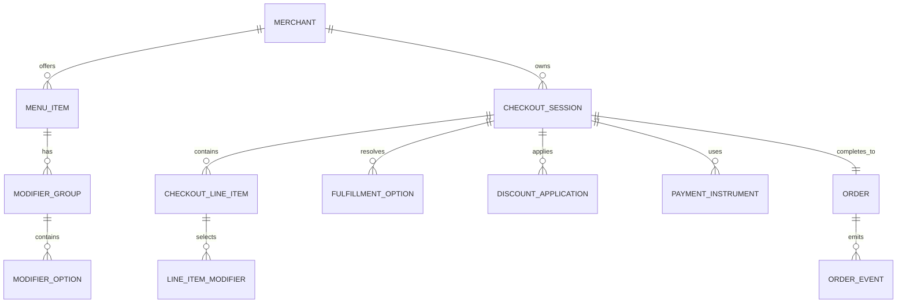
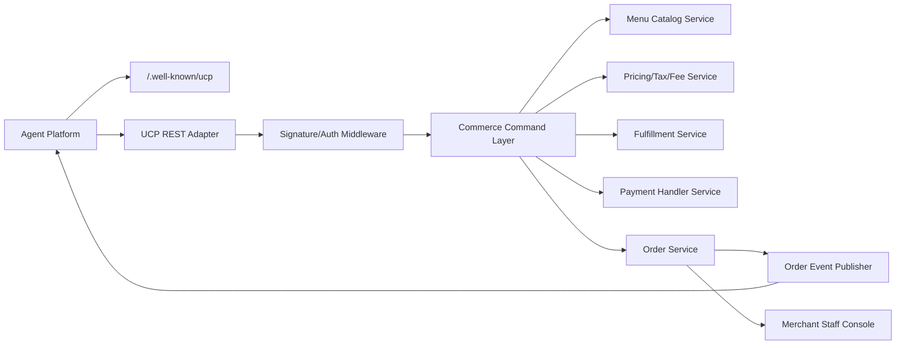

# UCP Agentic Commerce Requirements and Design

## Document Information

| Field | Value |
|-------|-------|
| Feature | Agentic Commerce / UCP Readiness |
| Author | Airo Engineering Team |
| Status | Draft |
| Created | 2026-05-19 |
| Last Updated | 2026-05-19 |
| Related Decision | [ADR-0005: Adopt UCP-Compatible Commerce Adapter](../../adr/0005-ucp-compatible-commerce-adapter.md) |

---

## 1. Overview

Airo should adopt Universal Commerce Protocol (UCP) concepts as the commerce boundary for agent-driven ordering, while keeping the internal restaurant/order domain independent of any one external protocol. The first implementation should make Airo UCP-compatible at the domain and API-adapter level, then expose public UCP endpoints once merchant onboarding, payment handling, and partner platform access are ready.

This document is written for a restaurant ordering use case, but the design should remain generic enough for other commerce surfaces in the Airo super app.

---

## 2. Goals

- Enable AI agents to discover a merchant menu, build a cart, resolve pricing, and place an order through deterministic APIs.
- Align internal models with UCP primitives: business profile, services, capabilities, checkout session, fulfillment, discounts, payment handlers, and order lifecycle.
- Preserve Airo's existing offline-first and privacy-first principles for user-side workflows.
- Keep the merchant as Merchant of Record and owner of order acceptance, pricing, fulfillment, and customer relationship.
- Support human handoff when a transaction requires confirmation, substitution approval, payment challenge, or restricted-item validation.
- Make the design compatible with future Google/Gemini UCP paths and OpenAI/Stripe ACP paths without coupling the core domain to either.

## 3. Non-Goals

- Full UCP certification or conformance test completion in the first milestone.
- Automatic listing inside Gemini, Google Search, ChatGPT, or other agent surfaces.
- Building a payment processor or storing raw card credentials.
- Supporting highly regulated goods in v1.
- Replacing the existing in-app ordering UI with agent-only flows.
- Implementing ACP in the same release as the first UCP-compatible adapter.

---

## 4. Actors

| Actor | Responsibility |
|-------|----------------|
| Buyer | Requests items, approves cart, authorizes payment, receives order updates. |
| Agent Platform | Discovers merchant capabilities and calls commerce endpoints on behalf of the buyer. |
| Airo Commerce API | Owns checkout session state, pricing, fulfillment options, order creation, and order lifecycle. |
| Merchant | Owns menu, availability, fulfillment rules, acceptance/rejection, and operational preparation. |
| Payment Handler / PSP | Tokenizes payment instruments and processes payment without exposing raw credentials to Airo clients. |
| Staff Console | Receives incoming orders, handles exceptions, substitutions, cancellation, and handoff. |

---

## 5. UCP Adoption Strategy

### Phase 1: UCP-Compatible Domain

Build internal commerce entities that map cleanly to UCP:

- `MerchantProfile`
- `CommerceCapability`
- `MenuCatalog`
- `CheckoutSession`
- `LineItem`
- `ModifierSelection`
- `FulfillmentOption`
- `DiscountApplication`
- `PaymentHandlerConfig`
- `PaymentInstrument`
- `Order`
- `OrderLifecycleEvent`

No public UCP endpoint is required in this phase.

### Phase 2: UCP Profile and REST Adapter

Expose:

- `GET /.well-known/ucp`
- `POST /ucp/v1/checkout-sessions`
- `GET /ucp/v1/checkout-sessions/{id}`
- `PUT /ucp/v1/checkout-sessions/{id}`
- `POST /ucp/v1/checkout-sessions/{id}/complete`
- `GET /ucp/v1/orders/{id}`
- `POST /ucp/v1/order-events` for webhook ingestion if Airo acts as an agent-facing aggregator

The UCP adapter translates external payloads into internal domain commands.

### Phase 3: Payment and Platform Integrations

Add production payment handlers and partner-specific onboarding:

- Google Pay / AP2-compatible flow for Google surfaces.
- Stripe payment handler or ACP bridge for ChatGPT-style instant checkout.
- Shop Pay only if merchant platform and policy requirements justify it.

### Phase 4: Conformance and Partner Rollout

- Run UCP conformance checks.
- Add version negotiation support for newer UCP spec dates.
- Add partner allowlists, rate limits, fraud signals, and operational dashboards.

---

## 6. Functional Requirements

### 6.1 Business Profile Discovery

The system must publish a public, unauthenticated UCP profile at `/.well-known/ucp` once public agent access is enabled.

Requirements:

- Declare supported UCP version, initially targeting the active stable spec version selected during implementation.
- Use UCP `2026-04-08` as the planning baseline as of 2026-05-19, then re-verify before implementation.
- Declare shopping service endpoint and transport.
- Declare supported capabilities: checkout, fulfillment, discount, and order lifecycle.
- Declare payment handlers only when they are actually available for the merchant and cart context.
- Publish signing keys for message verification.
- Avoid exposing private merchant configuration, staff-only endpoints, inventory thresholds, or credentials.

### 6.2 Menu and Catalog Projection

The internal menu model must produce an agent-safe catalog projection.

Requirements:

- Include item name, description, price, image URL when available, availability, dietary tags, and option groups.
- Represent modifiers with min/max selection rules, price deltas, defaults, and incompatible combinations.
- Exclude hidden, staff-only, unavailable, or location-ineligible items.
- Support item availability windows and sold-out state.
- Support locale, currency, and tax jurisdiction metadata.

### 6.3 Checkout Session

Agents must create and update checkout sessions deterministically.

Requirements:

- Create checkout from line items, buyer context, fulfillment preference, and optional discount/loyalty context.
- Return server-authoritative item resolution, prices, fees, taxes, totals, available fulfillment options, and payment handlers.
- Support idempotency keys for create, update, and complete operations.
- Reject invalid modifier combinations with machine-readable error codes.
- Maintain session version or ETag semantics to prevent lost updates.
- Expire inactive sessions and return a recoverable status.

### 6.4 Fulfillment

The system must support restaurant-specific fulfillment modes.

Requirements:

- Dine-in with table/QR context.
- Pickup with quoted preparation time.
- Delivery as optional later scope, gated by service area and delivery fee support.
- Merchant pause/close state.
- Kitchen capacity rules, item prep-time overrides, and cutoff windows.

### 6.5 Discounts and Loyalty

Discount handling must be server-authoritative.

Requirements:

- Accept coupon codes, loyalty identifiers, and campaign references.
- Return applied, rejected, and pending discount states.
- Explain rejection with stable machine codes, not only human text.
- Prevent discount stacking that violates merchant rules.
- Keep loyalty account linking optional for v1.

### 6.6 Payment

Payments must use tokenized payment instruments through payment handlers.

Requirements:

- Do not store raw card credentials.
- Support payment handler negotiation based on merchant, buyer, fulfillment mode, region, and cart contents.
- Accept opaque payment credentials from supported handlers.
- Support `requires_buyer_input` states for 3DS, wallet challenge, or final confirmation.
- Separate authorization and capture if the merchant acceptance workflow requires it.
- Record PSP reference IDs and reconciliation metadata.

### 6.7 Human Handoff

The system must pause agent automation when human input is required.

Triggers:

- Payment challenge or failed authorization.
- Substitution required.
- Age/restricted item validation.
- Out-of-stock item after checkout creation.
- High-value or abnormal order.
- Merchant manual acceptance requirement.

Requirements:

- Return a stable status such as `requires_buyer_input`, `requires_merchant_action`, or `requires_agent_retry`.
- Include a continuation URL only when a secure web handoff is available.
- Preserve checkout state across handoff and retry.

### 6.8 Order Lifecycle

Agents and buyers must receive order status updates.

Required states:

- `created`
- `accepted`
- `rejected`
- `preparing`
- `ready_for_pickup`
- `out_for_delivery`
- `completed`
- `cancelled`
- `refunded`

Requirements:

- Provide order lookup by ID.
- Emit lifecycle events to subscribed platforms or internal notification channels.
- Include timestamps, reason codes, and actor metadata.
- Support partial refunds and item-level cancellation later, but not in v1.

---

## 7. Non-Functional Requirements

### Security

- Require TLS for every public endpoint.
- Verify request signatures for agent/platform calls once public access is enabled.
- Use OAuth 2.0 or equivalent account-linking flow for buyer-specific benefits.
- Store signing keys and payment configuration in secure storage.
- Add replay protection using request IDs, timestamps, and idempotency keys.

### Privacy

- Minimize buyer data in checkout sessions.
- Do not include unnecessary PII in agent-visible order events.
- Provide audit logs for buyer-authorized agent actions.
- Follow Airo's offline-first privacy posture for local user workflows.

### Reliability

- Checkout create/update/complete must be idempotent.
- Menu availability must be eventually consistent but checkout totals must be strongly server-authoritative.
- Payment completion must be resilient to duplicate agent retries.
- Order creation must be transactional with payment state.

### Observability

- Log request ID, agent ID, merchant ID, checkout ID, order ID, capability, status, latency, and error code.
- Emit metrics for checkout conversion, agent retries, payment challenge rate, handoff rate, and order rejection rate.
- Redact PII and payment tokens from logs.

### Compatibility

- Version all UCP adapter endpoints.
- Support server-selected capability negotiation.
- Keep internal domain commands stable even if UCP payload versions change.

---

## 8. Domain Model



### Key Entities

#### MerchantProfile

- `id`
- `displayName`
- `origin`
- `ucpVersion`
- `services`
- `capabilities`
- `paymentHandlers`
- `signingKeys`
- `status`

#### CheckoutSession

- `id`
- `merchantId`
- `buyerRef`
- `lineItems`
- `fulfillment`
- `discounts`
- `payment`
- `totals`
- `status`
- `expiresAt`
- `version`
- `createdAt`
- `updatedAt`

#### Order

- `id`
- `merchantId`
- `checkoutSessionId`
- `status`
- `fulfillment`
- `paymentStatus`
- `totals`
- `buyerContact`
- `createdAt`
- `acceptedAt`
- `completedAt`

---

## 9. Architecture



### Layering Rule

UCP payloads should terminate at the adapter. Internal services should receive domain commands such as `CreateCheckoutSessionCommand`, `UpdateCheckoutSessionCommand`, and `CompleteCheckoutSessionCommand`, not raw UCP JSON.

---

## 10. API Shape

### Public Discovery

```http
GET /.well-known/ucp
```

Returns the merchant/business profile with services, capabilities, payment handlers, and signing keys.

### Checkout Create

```http
POST /ucp/v1/checkout-sessions
Idempotency-Key: <uuid>
Request-Id: <uuid>
UCP-Agent: profile="<agent-profile-url>"
```

Creates a server-authoritative checkout session.

### Checkout Update

```http
PUT /ucp/v1/checkout-sessions/{checkoutSessionId}
Idempotency-Key: <uuid>
Request-Id: <uuid>
```

Updates line items, modifiers, fulfillment, discount codes, and buyer context.

### Checkout Complete

```http
POST /ucp/v1/checkout-sessions/{checkoutSessionId}/complete
Idempotency-Key: <uuid>
Request-Id: <uuid>
```

Submits payment instrument and creates an order, or returns a handoff/challenge state.

### Order Lookup

```http
GET /ucp/v1/orders/{orderId}
```

Returns order state and lifecycle summary.

---

## 11. Error Model

Use stable machine-readable error codes.

| Code | Meaning | Retryable |
|------|---------|-----------|
| `item_unavailable` | Item is no longer orderable. | Yes |
| `modifier_rule_violation` | Modifier selection fails merchant rules. | Yes |
| `fulfillment_unavailable` | Requested mode/time is unavailable. | Yes |
| `discount_rejected` | Discount cannot be applied. | Yes |
| `payment_handler_unavailable` | Requested payment path is unsupported for this cart. | Yes |
| `payment_requires_buyer_input` | Buyer must complete challenge/handoff. | Yes |
| `checkout_expired` | Session expired. | Yes |
| `merchant_closed` | Merchant is not accepting orders. | Yes |
| `order_rejected` | Merchant rejected the order. | No |
| `invalid_signature` | Request authentication failed. | No |

---

## 12. MVP Scope

### Must Have

- Internal domain model for checkout sessions and orders.
- UCP-shaped profile generator behind a feature flag.
- Menu projection with item/modifier availability.
- Checkout create/update/complete command handlers.
- Pickup and dine-in fulfillment.
- Mock payment handler for development.
- Order lifecycle events in local/internal event bus.
- Idempotency and request ID support.

### Should Have

- Public `/.well-known/ucp` in staging.
- Google Pay-compatible handler configuration in non-production mode.
- Discount code support.
- Staff-console handoff status.
- Conformance-oriented fixtures and contract tests.

### Later

- ACP bridge for ChatGPT/Stripe flows.
- Delivery fulfillment.
- Loyalty account linking.
- AP2 mandate flow.
- Partner-specific rollout dashboards.
- Full UCP conformance suite integration.

---

## 13. Acceptance Criteria

- A test agent can fetch a UCP-shaped merchant profile in staging.
- A test agent can create a checkout session from menu item IDs and modifier selections.
- The server returns authoritative totals and rejects invalid modifier combinations.
- The test agent can update fulfillment mode and receive updated totals.
- Completing a checkout with the mock payment handler creates exactly one order under duplicate retries.
- Order status changes emit lifecycle events.
- No raw payment credentials or buyer PII are written to application logs.
- Public UCP exposure can be disabled by merchant or environment feature flag.

---

## 14. Risks and Mitigations

| Risk | Mitigation |
|------|------------|
| UCP spec changes before adoption stabilizes. | Keep UCP in an adapter layer and version endpoint mappings. |
| Platform access is not automatic after implementation. | Treat UCP readiness as architecture groundwork; pursue partner onboarding separately. |
| Payment scope creates PCI risk. | Only accept opaque tokens from PSP/payment handlers; never process raw card data. |
| Restaurant menus have complex modifier rules. | Make modifier validation server-authoritative and test with real menus. |
| Agents retry completion and duplicate orders. | Require idempotency keys and transactional order creation. |
| Human handoff breaks the agent flow. | Persist session state and provide explicit continuation statuses. |

---

## 15. Implementation Plan

### Milestone 1: Domain Contracts

- Add commerce domain models and command interfaces.
- Add menu projection model.
- Add checkout totals model and error model.
- Add mock repositories for tests.

### Milestone 2: Checkout Engine

- Implement create/update/complete checkout commands.
- Add modifier validation.
- Add fulfillment resolution.
- Add mock payment handler.
- Add idempotency storage.

### Milestone 3: UCP Adapter

- Generate `/.well-known/ucp` profile.
- Map UCP REST requests to domain commands.
- Map domain responses/errors back to UCP-shaped responses.
- Add contract tests using stored fixtures.

### Milestone 4: Order Lifecycle

- Create order from checkout completion.
- Add order state machine.
- Add event publisher and consumer contract.
- Add staff handoff states.

### Milestone 5: Partner Readiness

- Add real payment handler configuration.
- Add request signing verification.
- Add conformance checks.
- Prepare staging rollout with selected merchants.

---

## 16. Open Questions

- Is the first merchant surface Airo-owned ordering, BrewStack QR ordering, or a reusable shared commerce package?
- Which payment handler should be production-first: Google Pay, Stripe, Razorpay, or a mock-to-PSP abstraction?
- Should merchant staff acceptance be required for every order, or only for exceptions?
- Does v1 need delivery, or should it ship with dine-in and pickup only?
- Which platform is the first target for agent distribution: Google/Gemini UCP, ChatGPT/ACP, or Airo's own agent?

---

## 17. References

- [Universal Commerce Protocol](https://ucp.dev/)
- [UCP GitHub Repository](https://github.com/Universal-Commerce-Protocol/ucp)
- [Google UCP Guide](https://developers.google.com/merchant/ucp)
- [Google: Under the Hood: Universal Commerce Protocol](https://developers.googleblog.com/under-the-hood-universal-commerce-protocol-ucp/)
- [Shopify Engineering: Building the Universal Commerce Protocol](https://shopify.engineering/UCP)
- [Agentic Commerce Protocol](https://www.agenticcommerce.dev/)
- [ACP GitHub Repository](https://github.com/agentic-commerce-protocol/agentic-commerce-protocol)
