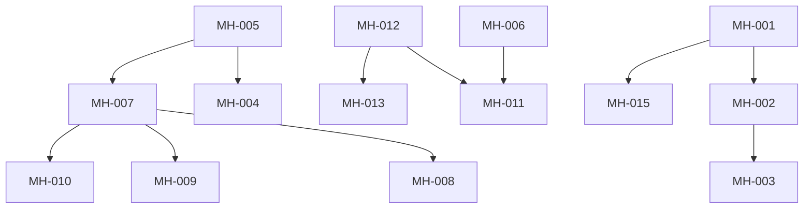

# Media Hub Engineering Tickets

## Overview

Engineering tickets based on PRD priority execution order. Tickets follow the existing Airo codebase patterns and are designed for parallel execution where possible.

---

## Priority Execution Order

1. Player resize + overlay controls
2. Content cards (replace rows)
3. Segmented Music / TV switch
4. Continue Watching / Listening
5. Category chips
6. Search enhancements
7. Micro-interactions polish

---

## Epic: MH - Media Hub Streaming Surface

---

## Sprint 1: Foundation (Priority 1-2)

### MH-001: Collapsible Hero Player Container
**Type:** Feature  
**Points:** 5  
**Assignee:** Flutter Dev  
**Labels:** `media-hub`, `player`, `high-priority`

**Description:**
Implement a collapsible player container that resizes based on scroll position.

**Acceptance Criteria:**
- [ ] Default collapsed height is ~65-70% of current height (200px mobile, 280px tablet)
- [ ] Player collapses smoothly on content scroll (300ms, easeOutCubic)
- [ ] Player expands to fullscreen on button tap
- [ ] State persists when navigating between tabs
- [ ] Scroll controller shared with discovery content

**Technical Notes:**
- Create `CollapsiblePlayerContainer` widget
- Use `AnimatedContainer` with `ScrollController` listener
- Follow existing pattern in `video_player_widget.dart`

**Files to Create/Modify:**
- `app/lib/features/media_hub/presentation/widgets/collapsible_player_container.dart` (new)
- `app/lib/features/media_hub/presentation/screens/media_hub_screen.dart` (modify)

---

### MH-002: Player Overlay Controls
**Type:** Feature  
**Points:** 3  
**Assignee:** Flutter Dev  
**Labels:** `media-hub`, `player`, `high-priority`

**Description:**
Implement overlay controls that appear on tap/hover with auto-hide behavior.

**Acceptance Criteria:**
- [ ] Controls visible on tap (mobile) or hover (web)
- [ ] Controls fade in/out with 300ms animation
- [ ] Auto-hide after 4 seconds of inactivity
- [ ] Actions: Play/Pause (center), Favorite, Fullscreen, Settings
- [ ] Timer resets on any interaction

**Technical Notes:**
- Extend existing pattern from `VideoPlayerWidget._buildControlsOverlay`
- Add `Timer` for auto-hide
- Use `MouseRegion` for web hover detection

**Files to Create/Modify:**
- `app/lib/features/media_hub/presentation/widgets/player_overlay_controls.dart` (new)

---

### MH-003: Settings Bottom Sheet
**Type:** Feature  
**Points:** 3  
**Assignee:** Flutter Dev  
**Labels:** `media-hub`, `player`, `settings`

**Description:**
Create a settings panel for quality, audio, and playback speed.

**Acceptance Criteria:**
- [ ] Opens as modal bottom sheet
- [ ] Quality options: Auto, 480p, 720p, 1080p
- [ ] Audio language selector (if multiple available)
- [ ] Playback speed (Music mode only): 0.5x, 1x, 1.5x, 2x
- [ ] User preferences persist across sessions

**Technical Notes:**
- Create `QualitySettings` model and `qualitySettingsProvider`
- Use `showModalBottomSheet` with `DraggableScrollableSheet`
- Store preferences in `SharedPreferences`

**Files to Create/Modify:**
- `app/lib/features/media_hub/presentation/widgets/settings_bottom_sheet.dart` (new)
- `app/lib/features/media_hub/domain/models/quality_settings.dart` (new)
- `app/lib/features/media_hub/application/providers/settings_provider.dart` (new)

---

### MH-004: Media Content Card Widget
**Type:** Feature  
**Points:** 5  
**Assignee:** Flutter Dev  
**Labels:** `media-hub`, `content`, `high-priority`

**Description:**
Replace text rows with visual content cards for better discovery.

**Acceptance Criteria:**
- [ ] Card displays: Channel/Artist image, Title, Genre tag
- [ ] LIVE badge for TV live content
- [ ] Optional viewer count display
- [ ] Lazy-load thumbnails with fade-in (200ms)
- [ ] TV layout: 2-column grid
- [ ] Music layout: horizontal carousel

**Technical Notes:**
- Create reusable `MediaContentCard` widget
- Use `CachedNetworkImage` for thumbnails
- Add `FadeInImage` or `AnimatedOpacity` for lazy loading

**Files to Create/Modify:**
- `app/lib/features/media_hub/presentation/widgets/media_content_card.dart` (new)
- `app/lib/features/media_hub/presentation/widgets/content_grid.dart` (new)
- `app/lib/features/media_hub/presentation/widgets/content_carousel.dart` (new)

---

### MH-005: Unified Media Content Model
**Type:** Technical  
**Points:** 3  
**Assignee:** Flutter Dev  
**Labels:** `media-hub`, `domain`, `foundation`

**Description:**
Create unified content model that bridges Music and TV content.

**Acceptance Criteria:**
- [ ] `UnifiedMediaContent` model with all required fields
- [ ] Factory methods: `fromChannel()`, `fromTrack()`
- [ ] Resume functionality support (lastPosition, canResume)
- [ ] Equatable for efficient state comparison

**Technical Notes:**
- Follow existing patterns from `MusicTrack` and `IPTVChannel`
- Place in domain layer

**Files to Create/Modify:**
- `app/lib/features/media_hub/domain/models/unified_media_content.dart` (new)
- `app/lib/features/media_hub/domain/models/media_mode.dart` (new)
- `app/lib/features/media_hub/domain/models/media_category.dart` (new)

---

## Sprint 2: Mode Switching & Personalization (Priority 3-4)

### MH-006: Segmented Mode Switch
**Type:** Feature
**Points:** 3
**Assignee:** Flutter Dev
**Labels:** `media-hub`, `navigation`, `high-priority`

**Description:**
Replace tab bar with segmented control for Music/TV mode switching.

**Acceptance Criteria:**
- [ ] Segmented control with icons + labels: 🎵 Music, 📺 TV
- [ ] Strong active indicator (underline + primary color)
- [ ] Smooth transition animation (300ms)
- [ ] Mode switch does NOT stop playback unless source incompatible
- [ ] State persists via Riverpod provider

**Technical Notes:**
- Create custom `MediaModeSwitch` widget (not using default `SegmentedButton`)
- Use `selectedMediaModeProvider` for state

**Files to Create/Modify:**
- `app/lib/features/media_hub/presentation/widgets/media_mode_switch.dart` (new)
- `app/lib/features/media_hub/application/providers/media_hub_providers.dart` (new)

---

### MH-007: Personalization State Management
**Type:** Technical
**Points:** 5
**Assignee:** Flutter Dev
**Labels:** `media-hub`, `state`, `personalization`

**Description:**
Implement personalization state for Continue Watching, Recent, and Favorites.

**Acceptance Criteria:**
- [ ] `PersonalizationState` model with all required fields
- [ ] `PersonalizationNotifier` for state mutations
- [ ] Persist to local storage (Hive)
- [ ] Load on app start
- [ ] Track playback positions for resume

**Technical Notes:**
- Follow existing patterns from `offers_provider.dart`
- Use Hive for offline persistence

**Files to Create/Modify:**
- `app/lib/features/media_hub/domain/models/personalization_state.dart` (new)
- `app/lib/features/media_hub/application/providers/personalization_provider.dart` (new)
- `app/lib/features/media_hub/data/repositories/personalization_repository.dart` (new)

---

### MH-008: Continue Watching Section
**Type:** Feature
**Points:** 3
**Assignee:** Flutter Dev
**Labels:** `media-hub`, `personalization`, `high-priority`

**Description:**
Show Continue Watching/Listening section with resume capability.

**Acceptance Criteria:**
- [ ] Horizontal carousel at top of discovery
- [ ] Shows partially watched/listened content
- [ ] Progress bar on cards
- [ ] Tap resumes from last position
- [ ] Only shows content with >10 seconds played

**Technical Notes:**
- Create `PersonalizationCarousel` widget
- Use `continueContentProvider` for data
- Add progress indicator to `MediaContentCard`

**Files to Create/Modify:**
- `app/lib/features/media_hub/presentation/widgets/personalization_carousel.dart` (new)
- `app/lib/features/media_hub/presentation/widgets/media_content_card.dart` (modify)

---

### MH-009: Recently Played Section
**Type:** Feature
**Points:** 2
**Assignee:** Flutter Dev
**Labels:** `media-hub`, `personalization`

**Description:**
Show recently played content section.

**Acceptance Criteria:**
- [ ] Horizontal carousel showing last 20 items
- [ ] Sorted by most recent first
- [ ] Filters by current mode (Music/TV)

**Technical Notes:**
- Reuse `PersonalizationCarousel` with different data provider

---

### MH-010: Favorites Section
**Type:** Feature
**Points:** 2
**Assignee:** Flutter Dev
**Labels:** `media-hub`, `personalization`

**Description:**
Show user's favorited content.

**Acceptance Criteria:**
- [ ] Horizontal carousel showing favorites
- [ ] Heart icon on favorited cards
- [ ] Tap favorite button toggles state

**Technical Notes:**
- Use `favoritesProvider` for data

---

## Sprint 3: Discovery & Search (Priority 5-6)

### MH-011: Category Chips Bar
**Type:** Feature
**Points:** 3
**Assignee:** Flutter Dev
**Labels:** `media-hub`, `discovery`, `high-priority`

**Description:**
Horizontal scrollable category chips for content filtering.

**Acceptance Criteria:**
- [ ] TV: Live, Movies, Kids, Music, Regional, News
- [ ] Music: Trending, Regional, Indie, Devotional, Chill, Focus
- [ ] Chips contextual to active mode
- [ ] Active chip highlighted with animation (200ms)
- [ ] Selection filters content instantly

**Technical Notes:**
- Create `CategoryChipsBar` widget
- Use `selectedCategoryProvider` for state
- Use `filteredContentProvider` for derived data

**Files to Create/Modify:**
- `app/lib/features/media_hub/presentation/widgets/category_chips_bar.dart` (new)
- `app/lib/features/media_hub/presentation/widgets/category_chip.dart` (new)

---

### MH-012: Discovery State Management
**Type:** Technical
**Points:** 3
**Assignee:** Flutter Dev
**Labels:** `media-hub`, `state`, `discovery`

**Description:**
Implement discovery state for browsing and filtering content.

**Acceptance Criteria:**
- [ ] `DiscoveryState` model
- [ ] `DiscoveryNotifier` for state mutations
- [ ] Integration with existing music and IPTV providers
- [ ] Pagination support

**Technical Notes:**
- Create bridge providers that combine music and IPTV data

**Files to Create/Modify:**
- `app/lib/features/media_hub/domain/models/discovery_state.dart` (new)
- `app/lib/features/media_hub/application/providers/discovery_provider.dart` (new)

---

### MH-013: Smart Search
**Type:** Feature
**Points:** 5
**Assignee:** Flutter Dev
**Labels:** `media-hub`, `search`

**Description:**
Unified search across Music and TV content.

**Acceptance Criteria:**
- [ ] Placeholder: "Search channels, artists, genres…"
- [ ] On focus: Recent searches, Suggested categories, Trending
- [ ] Results grouped by type (Music/TV)
- [ ] Debounced search (300ms)
- [ ] Minimum 2 characters before search

**Technical Notes:**
- Create `MediaSearchDelegate` or custom search widget
- Persist recent searches

**Files to Create/Modify:**
- `app/lib/features/media_hub/presentation/widgets/media_search_bar.dart` (new)
- `app/lib/features/media_hub/presentation/screens/search_results_screen.dart` (new)
- `app/lib/features/media_hub/application/providers/search_provider.dart` (new)

---

## Sprint 4: Polish & Platform (Priority 7)

### MH-014: Micro-Interactions & Animations
**Type:** Enhancement
**Points:** 3
**Assignee:** Flutter Dev
**Labels:** `media-hub`, `polish`, `animations`

**Description:**
Add polish through micro-interactions and animations.

**Acceptance Criteria:**
- [ ] Player collapse animation (300ms, easeOutCubic)
- [ ] Chip selection animation (200ms, easeOut)
- [ ] Mode switch animation (300ms, easeInOut)
- [ ] Controls fade (300ms, linear)
- [ ] Thumbnail fade-in (200ms)
- [ ] Haptic feedback on tap (mobile)

**Technical Notes:**
- Use `AnimatedContainer`, `AnimatedOpacity`, `AnimatedSwitcher`
- Add `HapticFeedback.lightImpact()` on mobile taps

---

### MH-015: Mini Player Bar
**Type:** Feature
**Points:** 3
**Assignee:** Flutter Dev
**Labels:** `media-hub`, `player`

**Description:**
Persistent mini player that appears above bottom navigation.

**Acceptance Criteria:**
- [ ] Shows when content is playing and not on Media Hub
- [ ] Displays: Thumbnail, Title, Play/Pause, Next
- [ ] Tap expands to full player
- [ ] Height: 64px mobile, 72px tablet
- [ ] Respects safe areas (iOS/Android)

**Technical Notes:**
- Extend existing `MiniPlayer` pattern
- Add to `AppShell` conditionally

**Files to Create/Modify:**
- `app/lib/features/media_hub/presentation/widgets/unified_mini_player.dart` (new)
- `app/lib/core/app/app_shell.dart` (modify)

---

### MH-016: Responsive Layouts
**Type:** Enhancement
**Points:** 3
**Assignee:** Flutter Dev
**Labels:** `media-hub`, `responsive`

**Description:**
Implement responsive layouts for different screen sizes.

**Acceptance Criteria:**
- [ ] Mobile (<600dp): Single column, 200px player
- [ ] Tablet (600-1200dp): 2-column grid, 280px player
- [ ] Desktop (>1200dp): 3-4 column, max-width container

**Technical Notes:**
- Use `LayoutBuilder` and `MediaQuery`
- Create responsive breakpoint constants

---

### MH-017: Accessibility Compliance
**Type:** Enhancement
**Points:** 3
**Assignee:** Flutter Dev
**Labels:** `media-hub`, `accessibility`, `a11y`

**Description:**
Ensure WCAG AA compliance.

**Acceptance Criteria:**
- [ ] Touch targets ≥ 44px
- [ ] Color contrast ≥ 4.5:1
- [ ] Semantic labels on all controls
- [ ] Dynamic text support
- [ ] Clear focus states (web)

**Technical Notes:**
- Use `Semantics` widget
- Test with screen readers
- Use `flutter_lints` accessibility rules

---

## Platform-Specific Tickets

### MH-AND-001: Android Foreground Service
**Type:** Platform
**Points:** 5
**Assignee:** Flutter Dev (Android)
**Labels:** `media-hub`, `android`, `platform`

**Description:**
Implement foreground service for background audio on Android.

**Acceptance Criteria:**
- [ ] Foreground service for background playback
- [ ] Notification media controls (play/pause, skip)
- [ ] Lock screen controls
- [ ] Bluetooth headset support
- [ ] Auto-duck during calls

**Technical Notes:**
- Use `audio_service` package
- Extend existing music service implementation

---

### MH-IOS-001: iOS System Integration
**Type:** Platform
**Points:** 5
**Assignee:** Flutter Dev (iOS)
**Labels:** `media-hub`, `ios`, `platform`

**Description:**
Implement iOS-specific media integration.

**Acceptance Criteria:**
- [ ] Now Playing integration
- [ ] Lock screen controls
- [ ] Control Center controls
- [ ] Respect silent switch (Music only)
- [ ] Safe-area aware layouts

**Technical Notes:**
- Configure `audio_service` for iOS
- Test on multiple device sizes

---

### MH-WEB-001: Web Keyboard Shortcuts
**Type:** Platform
**Points:** 2
**Assignee:** Flutter Dev (Web)
**Labels:** `media-hub`, `web`, `platform`

**Description:**
Implement keyboard shortcuts for web.

**Acceptance Criteria:**
- [ ] Space → Play/Pause
- [ ] F → Fullscreen
- [ ] M → Mute
- [ ] Arrow keys for seeking (optional)

**Technical Notes:**
- Use `Focus` and `KeyboardListener`
- Consider `FocusableActionDetector`

---

## Design Tickets

### MH-DES-001: Media Hub Visual Design
**Type:** Design
**Points:** 5
**Assignee:** Designer
**Labels:** `media-hub`, `design`

**Description:**
Create visual design for Media Hub.

**Deliverables:**
- [ ] Figma designs for all states
- [ ] Mobile, tablet, desktop breakpoints
- [ ] Light and dark mode variants
- [ ] Animation specs
- [ ] Icon assets (if needed)

---

### MH-DES-002: Media Content Card Design
**Type:** Design
**Points:** 3
**Assignee:** Designer
**Labels:** `media-hub`, `design`

**Description:**
Design content cards for Music and TV.

**Deliverables:**
- [ ] TV card design (with LIVE badge)
- [ ] Music card design (with progress bar)
- [ ] Hover/selected states
- [ ] Loading placeholder

---

## Summary

| Sprint | Tickets | Total Points |
|--------|---------|--------------|
| Sprint 1 | MH-001 to MH-005 | 19 |
| Sprint 2 | MH-006 to MH-010 | 15 |
| Sprint 3 | MH-011 to MH-013 | 11 |
| Sprint 4 | MH-014 to MH-017 | 12 |
| Platform | MH-AND/IOS/WEB | 12 |
| Design | MH-DES-001/002 | 8 |
| **Total** | **20 tickets** | **77 points** |

---

## Dependencies

