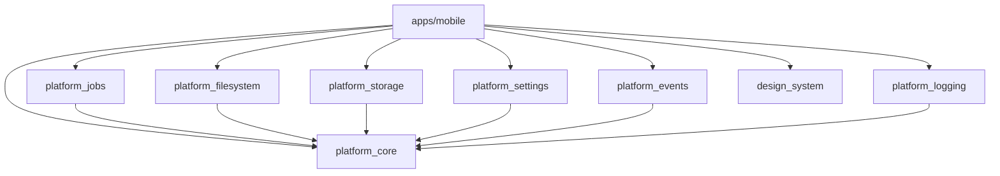
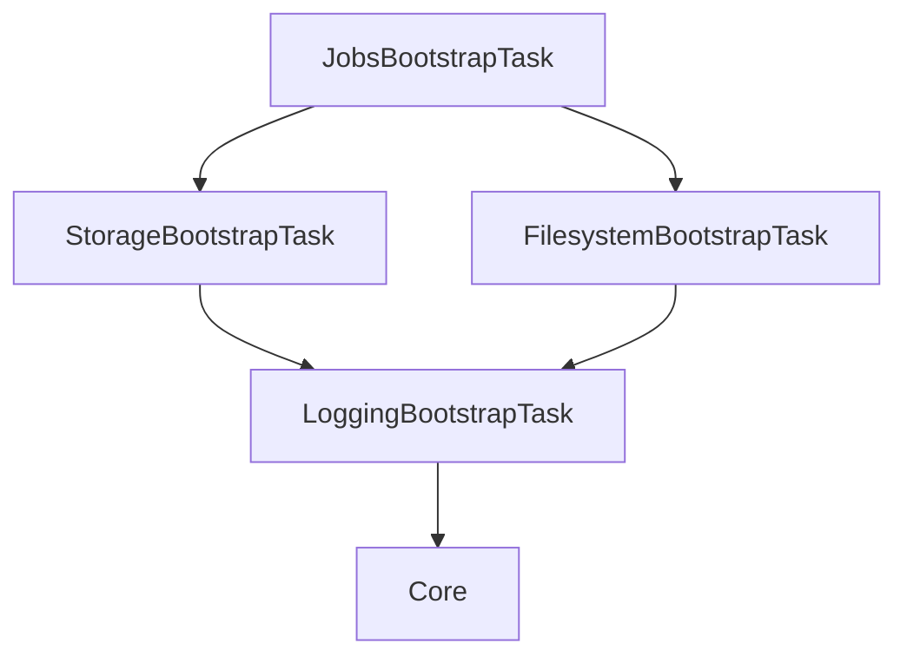

# Dependency Baseline (PFR-1)

## Package Dependency Graph
The platform packages exhibit a strict acyclic dependency graph flowing top-down.

## Bootstrap Dependency Graph
Tasks are executed by the `BootstrapCoordinator` based on their declared dependencies.

## Verification
- **Acyclic Graph**: Verified.
- **Ownership Rules**: Feature packages are not allowed to depend on other feature packages. Platform packages do not depend on feature packages.
- **No Forbidden Imports**: No `package:airo/` references exist in platform logic.
- **Implementation Leakage**: Public APIs are constrained in `api_baseline.md`.
