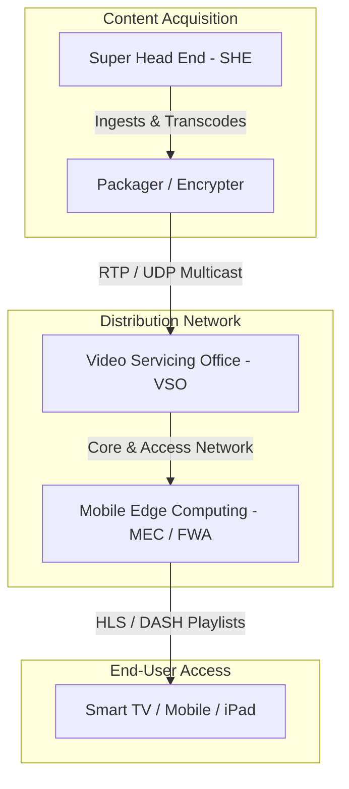
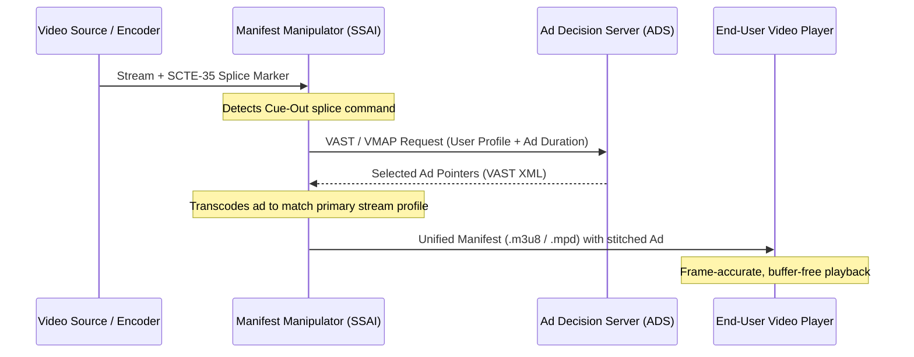

# IPTV Technology & Architecture Research

Welcome to the comprehensive technical and economic assessment of modern IPTV (Internet Protocol Television) and OTT (Over-The-Top) streaming platforms. This document synthesizes key architectural frameworks and advancements from academic surveys and recent streaming research, positioning the Airo TV ecosystem within this evolving landscape.

---

## 1. IPTV vs. Open-Network Internet TV (OTT)

While both IPTV and Over-The-Top (OTT) platforms deliver video content via Internet Protocols, they rely on fundamentally different network infrastructures and transmission paradigms. Understanding these differences highlights why private, managed services deliver superior Quality of Service (QoS).

| Parameter | Managed IPTV | Open-Network Internet TV (OTT) |
| :--- | :--- | :--- |
| **Network Type** | Closed, managed private network (Operator-owned) | Open, public internet (Best-effort delivery) |
| **Transmission Method** | True Multicast (IGMP) & Unicast (RTSP/UDP) | Unicast (HTTP-based over TCP) |
| **Bandwidth Allocation** | Dedicated, reserved bandwidth slices | Shared, fluctuating bandwidth |
| **Quality of Service (QoS)** | Guaranteed QoS with traffic prioritization | Variable, dependent on network congestion |
| **Content Security** | Deep network-level encryption & hardware-tied DRM | Client-side software/hardware DRM (Widevine, FairPlay) |
| **Latency & Jitter** | Minimal and highly predictable | Variable, subject to network routing congestion |

---

## 2. IPTV Network Architecture

A professional IPTV platform depends on a structured, three-tier architecture to ingest, distribute, and display high-definition media. 

### Key Architectural Nodes
*   **Super Head End (SHE):** The central nervous system of the platform. The SHE aggregates live satellite feed, cable channels, and Video-on-Demand (VoD) catalogs. It transcodes incoming video signals into transmission-ready codecs (such as H.264/AVC or H.265/HEVC), injects structural metadata (Electronic Program Guides), and prepares stream segments for advertisement insertion.
*   **Video Servicing Office (VSO):** Localized distribution points that cache popular on-demand assets and manage regional multicast groups. By caching assets closer to the access network, VSOs prevent backbone network congestion.
*   **Content Delivery Networks (CDNs) & Edge Computing:** To scale to millions of concurrent viewers, IPTV architectures deploy Edge Nodes—specifically Mobile Edge Computing (MEC) units inside 5G base stations or Fixed Wireless Access (FWA) routers. Processing manifests and caching segments at the absolute edge minimizes channel-switching latency ("zapping time") and enables localized ad insertion.

---

## 3. Core Protocols & Multicast Mechanisms

To optimize distribution across millions of end-user endpoints, IPTV utilizes specialized networking protocols.

### True Multicast via IGMP
Unlike open-network OTT services where every device requests its own unique stream (Unicast), IPTV delivers live broadcasts via Multicast. The network leverages the **Internet Group Management Protocol (IGMP)** to create a shared distribution tree. A single stream is duplicated inside the network routers as close to the target viewers as possible.

Let \(N\) represent the number of concurrent subscribers, and \(B\) represent the stream bitrate (e.g., 10 Mbps for HD):

*   **Unicast Bandwidth Demand:** 
    \[W_{\text{unicast}} = N \cdot B\]
*   **Multicast Bandwidth Demand:** 
    \[W_{\text{multicast}} \approx B\]

By holding network trunk load to a constant factor, multicast ensures that the network backbone does not collapse during high-concurrency live events (e.g., live sports finals).

### Transport and Session Control
*   **RTP/UDP (Real-time Transport Protocol over User Datagram Protocol):** RTP runs on top of UDP to provide low-latency transmission. Unlike TCP, UDP does not enforce strict packet retransmission loops, which cause video freezing. Packet loss is instead mitigated using Forward Error Correction (FEC) algorithms that reconstruct missing bits at the client side.
*   **RTSP (Real-Time Streaming Protocol):** Utilized for session control in VoD streaming. It functions as a "network remote control," translating player actions (Play, Pause, Seek, Rewind) into immediate server-side state adjustments.

---

## 4. Advanced Video Compression & Bitrate Adaptation

Hardware and bandwidth constraints require intelligent video encoding solutions that deliver optimal Quality of Experience (QoE) regardless of screen size or internet speed.

### The Bitrate Ladder & Codec Standards
Video compression reduces spatial and temporal redundancy. Modern platforms employ a tiered codec strategy:
*   **H.264 / AVC:** Broadest hardware compatibility; baseline support for older set-top boxes (STBs).
*   **H.265 / HEVC:** The industry standard for 4K UHD. It offers a 50% bitrate reduction compared to H.264 for equivalent visual quality.
*   **AV1:** A royalty-free, open-source codec yielding an additional 30% compression efficiency over HEVC.
*   **VVC (Versatile Video Coding / H.266):** Next-generation standard targeting 8K and high-dynamic-range (HDR) streams at minimal bitrates.

### Scalable Video Coding (SVC)
SVC is an extension of H.264 and HEVC that encodes a single video stream into a base layer and multiple enhancement layers:
1.  **Base Layer:** Contains the minimum visual data required for playback (e.g., 360p resolution, 15 fps).
2.  **Temporal/Spatial Enhancement Layers:** Add frame rate (e.g., scaling to 60 fps) and spatial resolution (e.g., scaling to 1080p or 4K).
3.  **Quality/SNR Enhancement Layers:** Improve the signal-to-noise ratio for crisper picture detail.

With SVC, a single encoded file can serve a bandwidth-constrained mobile device (receiving only the base layer) and a fiber-connected Smart TV (receiving all enhancement layers) without duplicating storage costs on the server.

### Adaptive Bitrate Streaming (ABR)
Through protocols like **HTTP Live Streaming (HLS)** and **Dynamic Adaptive Streaming over HTTP (DASH)**, video files are segmented into small chunks (usually 2 to 10 seconds). The client player continually monitors its buffer length and available network bandwidth. If congestion is detected, the player requests a lower-bitrate segment for the next chunk, preventing playback freezes (graceful degradation).

---

## 5. Server-Side Ad Insertion (SSAI) & SCTE-35 Workflows

Traditional digital advertising relies on Client-Side Ad Insertion (CSAI). The client app pauses the video, calls an external ad server, fetches an ad file, and plays it. This introduces high latency, causes blank screens, and is easily bypassed by client-side ad blockers.

Modern platforms deploy **Server-Side Ad Insertion (SSAI)**, where advertisements are dynamically stitched directly into the primary video stream at the manifest or packager level.

### The SSAI Workflow
1.  **SCTE-35 Signaling:** Raw video streams contain embedded digital cue markers (SCTE-35) signaling upcoming ad breaks (cue-out), duration, and program return (cue-in).
2.  **Ad Decision Server (ADS) Resolution:** The manifest manipulator detects the SCTE-35 marker and requests an ad payload from the ADS using **VAST (Video Ad Serving Template)** or **VMAP (Video Multiple Ad Playlist)** protocols.
3.  **Manifest Manipulation:** The manifest manipulator transcodes the selected advertisement to match the exact resolution and bitrate ladder of the primary stream. It then stitches reference pointers into the stream's manifest.
4.  **Delivery:** The CDN serves the unified manifest. Because the ad segments look identical to the program segments, client-side blockers cannot filter them out, raising ad-fill rates to near 100%.

---

## 6. AI/ML Integration in Streaming

Artificial Intelligence and Machine Learning are shifting streaming platforms from reactive systems to predictive media ecosystems.

*   **Hyper-Personalized Discovery:** Machine learning models synthesize user behavior (temporal viewing habits, device switches) with deep semantic metadata. Using computer vision and Natural Language Processing (via services like Amazon Rekognition or Bedrock), platforms perform automated scene analysis and transcription to generate thousands of specific micro-tags, yielding highly accurate content matching.
*   **Predictive Network Quality (QoS):** Rather than waiting for a buffer to empty, AI models analyze real-time telemetry (packet loss, tower handoffs in 5G) to forecast bandwidth degradation. The stream bitrate is adjusted preemptively, decreasing buffering-induced churn by up to 30%.
*   **Contextual Ad Targeting:** Machine learning analyzes the emotional and narrative context of the video in real-time. If a user is watching a high-adrenaline racing documentary on an iPad, the system identifies the scene sentiment and dynamically injects highly relevant automotive or athletic ads, maximizing cost-per-mille (CPM) yields.

---

## 7. Strategic Business Case: Why Airo TV is an Investment, Not an Expense

In an era defined by inflation, subscription fatigue, and "subscription sprawl" (paying for multiple fragmented streaming apps), consumers and operators often view media streaming as a rising monthly liability. Airo TV changes this calculation. Adopting a high-performance, local-first client like Airo TV or upgrading to the advanced capabilities of Airo TV Pro is an **infrastructure investment** that pays immediate dividends.

### A. Consolidating Subscription Sprawl (Direct Financial Return)
Traditional streaming forces viewers to maintain multiple monthly subscriptions just to access distinct catalogs. Airo TV operates on a **Bring Your Own Content (BYOC)** model. By providing a single unified player for all authorized M3U/M3U8 playlists, users can aggregate live television, subscription networks, local media servers, and public FAST channels into a single interface. Investing in a single premium player eliminates the need for redundant app packages, delivering a complete return on capital within months.

### B. Tangible Network & Cellular Data Savings
In mobile-first and bandwidth-constrained markets (such as India, where low-cost cellular data packages are subject to daily bandwidth caps), streaming high-definition video is expensive. Airo TV’s integration of advanced codecs (HEVC and AV1) and adaptive client processing reduces data consumption by up to **50%** compared to legacy, unoptimized web players. This optimization protects users from overage charges and daily speed throttling, saving money on network data plans.

### C. Preserving Device Hardware Lifecycle
Client-side tracking, heavy Javascript bundles, and inefficient CSAI video players run hot, consuming massive CPU cycles. Over time, high thermal loads degrade the lithium-ion batteries of smartphones, iPads, and set-top boxes, shortening their usable lifespan. Airo TV relies on structured local worker processes (running heavy parsing off the main thread) and supports Server-Side Ad Insertion (SSAI). By bypassing heavy client-side ad scripts, the application consumes minimal battery power and runs cooler, preserving user hardware equity.

### D. Lifetime Equity in a Local-First Platform
Unlike commercial streaming apps where access is instantly revoked the moment a subscription terminates, purchasing the Airo TV client (or upgrading to Airo TV Pro features) secures a permanent digital tool. Your playlists, favorites, custom search indexes, and layout configurations are kept local and private. It is a long-term utility that continuously adapts to new open codecs and source formats without forcing you into recurring price hikes.

### E. Protecting Your Digital Privacy
Commercial streaming platforms generate massive revenue by tracking, packaging, and selling your viewing habits, search history, and geographic data to advertising brokers. Airo TV enforces a strict local-first privacy boundary. By processing data on-device and eliminating background telemetry tracking, Airo TV is an investment in your personal data sovereignty. Your viewing profile is never commodified, preserving your digital privacy asset.
