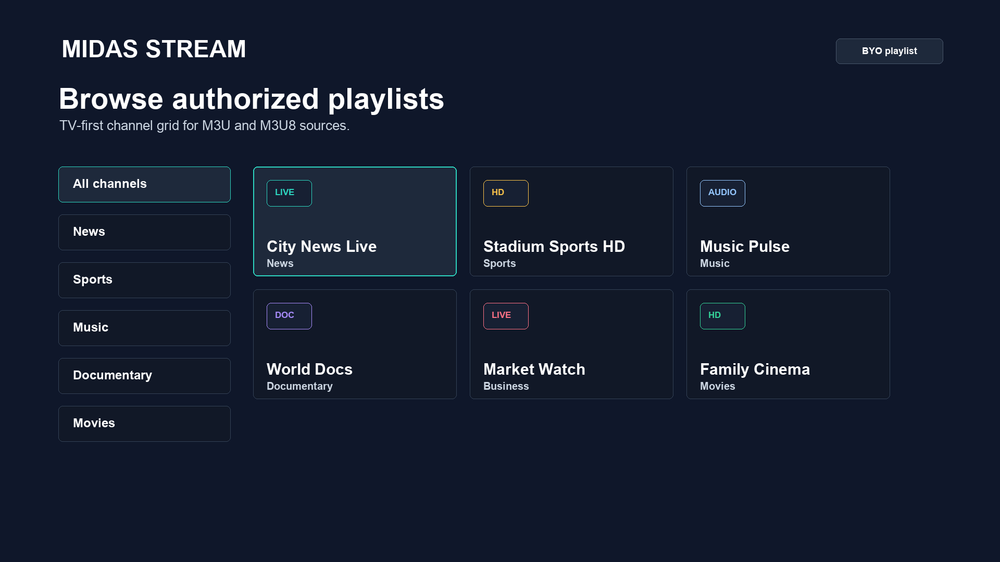

# Aika Stream 22 India Landing Implementation Plan

> **For agentic workers:** REQUIRED SUB-SKILL: Use superpowers:subagent-driven-development (recommended) or superpowers:executing-plans to implement this plan task-by-task. Steps use checkbox (`- [ ]`) syntax for tracking.

**Goal:** Rebuild `docs/aika-stream/in/` so the product is a television on a quiet page, not a card grid around a raw screenshot.

**Architecture:** The India page keeps the site header, footer, and `site.css` type scale. A page stylesheet (`india-22.css`) adds the device frame, the MultiView stage, and the Continue Watching rail. Motion is one timer, cancelled under `prefers-reduced-motion`.

**Tech Stack:** Static HTML, CSS, a few lines of JS. No new framework. No live HLS on this page.

**Spec:** `docs/superpowers/specs/2026-09-23-aika-stream-22-design.md`

## Global Constraints

- Background `#070A12`, surface `#101522`, secondary `#171D2B`, text `#FFFFFF`, muted `#8B93A7`. Accent is the existing Aika green, used for the primary button and the focus ring only.
- Hero headline is `Your TV. Reimagined.` Subcopy is `Live TV, music, news and entertainment in one beautiful experience.`
- Buttons: `Watch Aika Stream` (Play Store `com.developerscoffee.tv.midas`) and `Explore Features` (`#experience`).
- Do not publish third-party channel logos, broadcast frames, room photos, or a claim that Aika Stream supplies channels.
- The BYOC disclaimer at the bottom stays, including “does not sell, host, or provide television channels”.
- Screenshots inside the frame are owned store assets: `01-tv-home-channel-grid.png` and `02-tv-now-playing.png` under `docs/store-assets/airo-tv/`.
- MultiView copy may say one, side by side, and 2×2 because those layouts exist on the TV app. It must say the streams come from the user’s sources.
- `prefers-reduced-motion: reduce` shows the 2×2 frame and does not run the timer.
- Do not edit `app/` or `packages/` in this plan. Do not bump `pubspec_tv.yaml`.
- This commit is documentation and static site content. `[skip ci]` is allowed.

---

### Task 1: Page stylesheet and device frame

**Files:**
- Create: `docs/assets/airo-tv/india-22.css`
- Modify: `docs/aika-stream/in/index.html` (stylesheet link only in this task)
- Test: `docs/aika-stream/in/india-22.test.mjs` (node assert on the CSS file; no browser required)

**Interfaces:**
- Produces: classes `india-page`, `tv-stage`, `tv-bezel`, `tv-glass`, `tv-stand`, `hero-grid`

- [ ] **Step 1: Write the failing check**

```js
import { readFileSync } from 'node:fs';
import assert from 'node:assert/strict';

const css = readFileSync(
  new URL('../../assets/airo-tv/india-22.css', import.meta.url),
  'utf8',
);
assert.match(css, /#070A12/);
assert.match(css, /\.tv-bezel/);
assert.match(css, /prefers-reduced-motion:\s*reduce/);
assert.equal((css.match(/linear-gradient\(/g) || []).length, 0);
assert.match(css, /\.tv-stage[\s\S]*radial-gradient/);
```

The only glow is a `radial-gradient` on `.tv-stage`. Section backgrounds stay flat.

- [ ] **Step 2: Run it**

Run: `node docs/aika-stream/in/india-22.test.mjs`

Expected: FAIL. Missing file.

- [ ] **Step 3: Add the stylesheet**

```css
.india-page {
  background: #070A12;
  color: #fff;
}
.india-page .hero-grid {
  display: grid;
  grid-template-columns: minmax(280px, 460px) minmax(0, 1fr);
  gap: 64px;
  align-items: center;
  min-height: 78vh;
}
.tv-stage {
  position: relative;
  background:
    radial-gradient(ellipse at 50% 40%, rgba(80, 110, 220, 0.18), transparent 62%);
}
.tv-bezel {
  background: #101522;
  border-radius: 28px;
  padding: 18px 18px 28px;
  box-shadow: 0 40px 80px rgba(0, 0, 0, 0.45);
}
.tv-glass {
  aspect-ratio: 16 / 9;
  overflow: hidden;
  border-radius: 8px;
  background: #000;
}
.tv-glass img {
  width: 100%;
  height: 100%;
  object-fit: cover;
  display: block;
}
.tv-stand {
  width: 28%;
  height: 18px;
  margin: 0 auto;
  background: #171d2b;
  clip-path: polygon(12% 0, 88% 0, 100% 100%, 0 100%);
}
@media (max-width: 860px) {
  .india-page .hero-grid { grid-template-columns: 1fr; min-height: 0; }
}
@media (prefers-reduced-motion: reduce) {
  .india-page *, .india-page *::before { animation: none !important; transition: none !important; }
}
```

Link it from the India page after `site.css`:

```html
<link rel="stylesheet" href="../../assets/airo-tv/india-22.css" />
```

Add `class="india-page"` on `<body>`.

- [ ] **Step 4: Re-run the check**

Run: `node docs/aika-stream/in/india-22.test.mjs`

Expected: PASS.

- [ ] **Step 5: Commit**

```bash
git add docs/assets/airo-tv/india-22.css docs/aika-stream/in/index.html docs/aika-stream/in/india-22.test.mjs
git commit -m "docs(aika): add the India page device frame [skip ci]"
```

---

### Task 2: Replace the hero

**Files:**
- Modify: `docs/aika-stream/in/index.html` (the `#top` section)
- Modify: `docs/aika-stream/in/india-22.test.mjs`

**Interfaces:**
- Consumes: `.hero-grid`, `.tv-bezel`, `.tv-glass`, `.tv-stand`
- Produces: `#hero-title` text `Your TV. Reimagined.`

- [ ] **Step 1: Extend the check**

```js
const html = readFileSync(new URL('./index.html', import.meta.url), 'utf8');
assert.match(html, /Your TV\. Reimagined\./);
assert.match(html, /Watch Aika Stream/);
assert.match(html, /Explore Features/);
assert.match(html, /01-tv-home-channel-grid\.png/);
assert.doesNotMatch(html, /aika-stream-split-screen-banner\.jpg/);
assert.doesNotMatch(html, /Download APK/);
```

- [ ] **Step 2: Run it**

Expected: FAIL. The current H1 is `Watch more. At the same time.`

- [ ] **Step 3: Replace the hero section**

```html
<section class="hero" id="top">
  <div class="container hero-grid">
    <div class="hero-content">
      <p class="eyebrow">Aika Stream · India</p>
      <h1 id="hero-title">Your TV. Reimagined.</h1>
      <p class="hero-lede">Live TV, music, news and entertainment in one beautiful experience.</p>
      <div class="hero-actions">
        <a class="button button-primary" href="https://play.google.com/store/apps/details?id=com.developerscoffee.tv.midas">Watch Aika Stream</a>
        <a class="button button-secondary" href="#experience">Explore Features</a>
      </div>
    </div>
    <div class="tv-stage">
      <div class="tv-bezel">
        <div class="tv-glass">
          
        </div>
      </div>
      <div class="tv-stand" aria-hidden="true"></div>
    </div>
  </div>
</section>
```

Delete the cricket/music paragraph and the banner ``.

- [ ] **Step 4: Re-run**

Run: `node docs/aika-stream/in/india-22.test.mjs`

Expected: PASS.

- [ ] **Step 5: Commit**

```bash
git add docs/aika-stream/in/index.html docs/aika-stream/in/india-22.test.mjs
git commit -m "docs(aika): give the India hero a television [skip ci]"
```

---

### Task 3: MultiView, experience, continue watching, remote, content

**Files:**
- Modify: `docs/aika-stream/in/index.html`
- Modify: `docs/assets/airo-tv/india-22.css`
- Modify: `docs/aika-stream/in/india-22.test.mjs`
- Create: `docs/assets/airo-tv/india-22.js`

**Interfaces:**
- Produces: `#multiview` stage with `data-panes="1|2|4"`, `#continue` rail, `#remote`, `#library`
- JS: `startIndiaMotion(root)` no-ops when `matchMedia('(prefers-reduced-motion: reduce)').matches`, otherwise cycles panes every 2.4s

Replace `#split-screen` and `#features` (the emoji cards and the difference list). Keep `#devices` and `#trust`, then add the final CTA before the trust disclaimer.

- [ ] **Step 1: Extend the check**

```js
for (const heading of [
  'Watch more. At the same time.',
  'One screen. Everything you watch.',
  'Pick up where you left off.',
  'Designed for your TV.',
  'Simple enough for everyone.',
  'Everything you watch. In one place.',
  'One screen. Endless possibilities.',
  'Turn on your TV.',
]) {
  assert.match(html, new RegExp(heading.replace(/[.]/g, '\\.')));
}
assert.match(html, /data-panes="4"/);
assert.match(html, /does not sell, host, or provide television channels/);
assert.doesNotMatch(html, /India vs Afghanistan/);
```

- [ ] **Step 2: Run it**

Expected: FAIL until the sections exist.

- [ ] **Step 3: Add the sections and the script**

MultiView markup:

```html
<section class="band" id="multiview">
  <div class="container">
    <p class="eyebrow">MultiView</p>
    <h2>Watch more. At the same time.</h2>
    <p class="hero-lede">One screen, side by side, or four at once. The streams are yours.</p>
    <div class="mv-stage" data-india-multiview data-panes="1">
      <div class="mv-pane">1</div>
      <div class="mv-pane">2</div>
      <div class="mv-pane">3</div>
      <div class="mv-pane">4</div>
    </div>
  </div>
</section>
```

CSS for the stage (no `linear-gradient`):

```css
.mv-stage { display: grid; gap: 12px; background: #101522; padding: 12px; aspect-ratio: 16 / 9; }
.mv-stage[data-panes="1"] { grid-template-columns: 1fr; }
.mv-stage[data-panes="1"] .mv-pane:nth-child(n + 2) { display: none; }
.mv-stage[data-panes="2"] { grid-template-columns: 1fr 1fr; }
.mv-stage[data-panes="2"] .mv-pane:nth-child(n + 3) { display: none; }
.mv-stage[data-panes="4"] { grid-template-columns: 1fr 1fr; grid-template-rows: 1fr 1fr; }
.mv-pane { background: #171d2b; color: #8b93a7; display: grid; place-items: center; }
```

`india-22.js`:

```js
export function startIndiaMotion(root, media = window.matchMedia('(prefers-reduced-motion: reduce)')) {
  const stage = root.querySelector('[data-india-multiview]');
  if (!stage) return;
  if (media.matches) {
    stage.dataset.panes = '4';
    return;
  }
  const sequence = ['1', '2', '4'];
  let index = 0;
  stage.dataset.panes = sequence[0];
  window.setInterval(() => {
    index = (index + 1) % sequence.length;
    stage.dataset.panes = sequence[index];
  }, 2400);
}
```

Call it from a tiny inline module at the bottom of the page: `import { startIndiaMotion } from '../../assets/airo-tv/india-22.js'; startIndiaMotion(document);`

Experience section `#experience` is four lines, not cards: **Live TV** “Jump straight into live channels without navigating through complicated menus.” **Continue Watching** “Pick up exactly where you stopped.” **MultiView** “Watch multiple streams together on one screen.” **Fast & Simple** “Built for TV. Large controls. Fast navigation. No clutter.”

Continue Watching `#continue`: headline `Pick up where you left off.` A row of four `<div class="cw-card">` elements. CSS animates `.cw-card.is-selected` with `transform: scale(1.04)`. The script adds `is-selected` to one card at a time on the same timer as MultiView, and skips that class when reduced motion is set.

TV-first `#screens`: headline `Designed for your TV.` Copy `Aika Stream puts your entertainment where it belongs — on the big screen.` Three labeled frames: Phone, Tablet, TV. The TV frame reuses `02-tv-now-playing.png`. Phone and tablet frames are empty bezels with the words `Aika Stream`, not stock photography.

Remote `#remote`: headline `Simple enough for everyone.` Three lines: **Fast navigation**, **Big, clear controls**, **Instant playback**, with the sentences from the spec. No remote-control stock photo.

Library `#library`: headline `Everything you watch. In one place.` Three groups — **Live TV** `News · Entertainment · Sports · Kids`, **Music** `Music channels · Radio · Concerts`, **International** `Channels from around the world`. Horizontal strips of abstract `.tile` divs (initials only: N, E, S, K). A paragraph under the headline: `From the playlists you add. Aika Stream does not include a channel catalog.`

Showcase `#showcase`: `AIKA STREAM` / `One screen.` / `Endless possibilities.` / the same television frame / a quiet list `Live TV`, `MultiView`, `Music` / `Built for Android TV`.

Final CTA `#start`: `Turn on your TV.` / `Start watching with Aika Stream.` / the same Play link.

Nav links become `#multiview`, `#experience`, `#screens`, `#library`. Drop the hero APK button. Footer may keep a text link to the latest public GitHub release if one is already linked elsewhere on the site; do not invent a tag.

- [ ] **Step 4: Re-run the check and the branding audit**

Run: `node docs/aika-stream/in/india-22.test.mjs && python3 .agents/skills/airo-release-branding/scripts/audit_public_page.py`

Expected: the node check passes. Fix any audit failure that flags the new page before committing. If the audit does not know about `in/index.html`, record that in the commit message and do not weaken the audit to hide it.

- [ ] **Step 5: Commit**

```bash
git add docs/aika-stream/in/index.html docs/aika-stream/in/india-22.test.mjs \
  docs/assets/airo-tv/india-22.css docs/assets/airo-tv/india-22.js
git commit -m "docs(aika): present the India page as a TV product [skip ci]"
```

---

### Task 4: Feature-matrix honesty

**Files:**
- Modify: `docs/release/AIKA_STREAM_FEATURE_MATRIX.md`

- [ ] **Step 1: Add rows that match the page**

| Feature | Status | Notes |
| --- | --- | --- |
| Split Screen / MultiView layouts | Supported on Android TV | One, side by side, and 2×2 in the TV app. User-supplied streams only. |
| Bundled channels | Not supported | Unchanged. |

Do not mark phone or Fire TV MultiView as Supported. Fire TV stays “Experimental” on the India devices section.

- [ ] **Step 2: Commit**

```bash
git add docs/release/AIKA_STREAM_FEATURE_MATRIX.md
git commit -m "docs(aika): record MultiView layouts as user-supplied [skip ci]"
```
